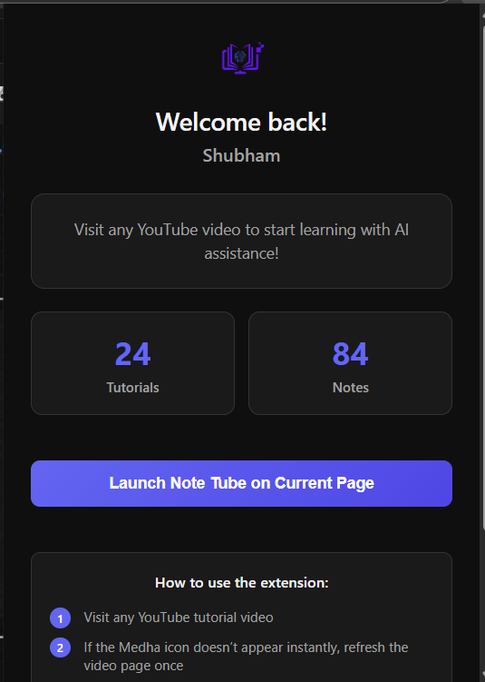
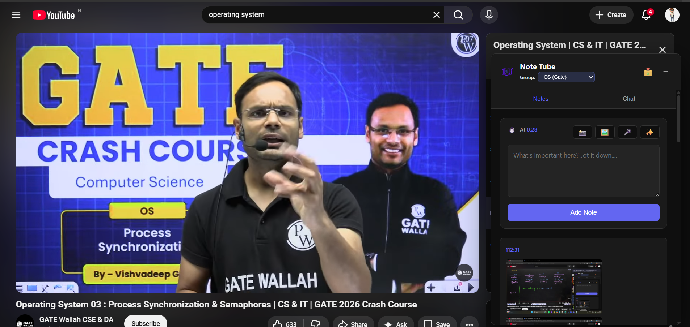
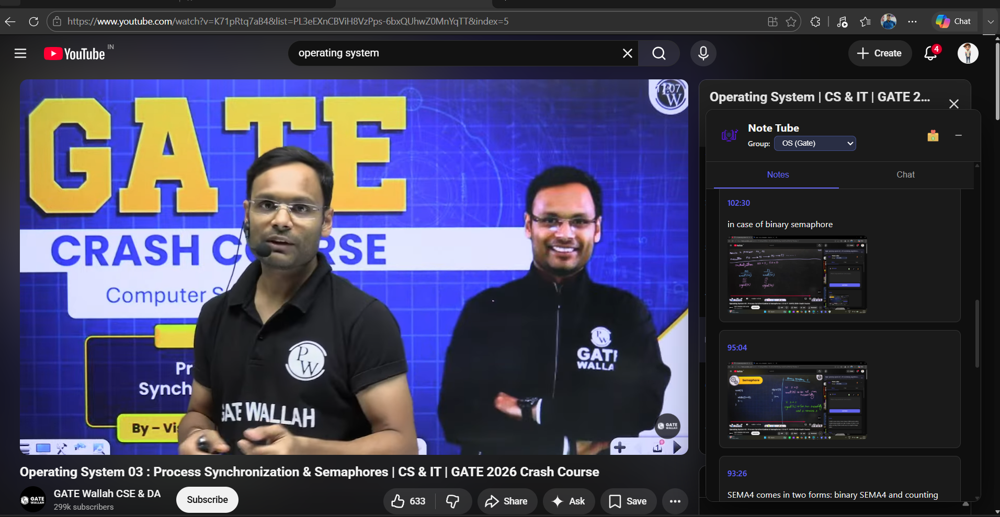
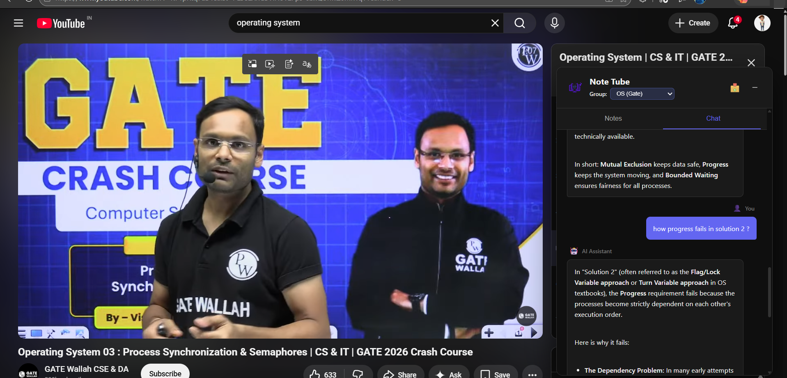

# Note Tube - Browser Extension

Note Tube is a powerful browser extension designed to supercharge your YouTube learning experience.

## What it Does
Note Tube injects an interactive side-panel directly into YouTube, giving you an AI-powered assistant and a dedicated workspace to take notes, ask questions, and summarize tutorials—without ever leaving the video page or juggling multiple tabs.

## The Problem it Solves
Switching back and forth between YouTube and a separate note-taking app is distracting and inefficient. You lose context, miss important timestamps, and constantly have to pause and rewind. Note Tube solves this by embedding a smart learning companion right into YouTube. It syncs your notes with the video timeline and provides an AI that understands the video context to answer your questions on the fly.

## Key Features
- **Smart Timestamped Notes**: Take notes that are automatically linked to the exact moment in the video. Click a timestamp later to jump right back to that spot.
- **AI Chat Assistant**: Ask questions about the tutorial you're watching, and the AI will provide contextual answers based on the video's content.
- **Voice Input**: Use your microphone to quickly dictate notes or chat with the AI, powered by Whisper speech-to-text.
- **AI Text Enhancement**: Instantly rewrite and polish your notes using our built-in AI rewriting tools.
- **Cloud Sync**: All your notes and chat history are securely saved and synced to your Note Tube account, allowing you to access them from any device and download them whenever you want.
- **Smart Grouping**: Organize your tutorials into custom folders and collections. Easily switch between different study groups to keep your workspace clutter-free and highly focused.

## Gallery









## Tech Stack
- **Frontend**: Vanilla HTML, CSS, JavaScript
- **API Communication**: `fetch` API interacting with our [FastAPI Backend](https://github.com/SHubhamanjk/note-tube-backend)
- **Styling**: Modern vanilla CSS with dynamic glassmorphism, responsive design, and fluid micro-animations
- **Browser APIs**: Chrome Extension API (Manifest V3, Service Workers, Content Scripts)


## Local Setup & Development

To run this extension locally, you need to set up both the backend API and the frontend extension.

### 1. Set Up the Backend
First, clone and start the backend server:
```bash
# Clone the backend repository
git clone https://github.com/SHubhamanjk/note-tube-backend.git
cd note-tube-backend

# Create a virtual environment and activate it
python -m venv .venv
# On Windows: .\.venv\Scripts\activate
# On Mac/Linux: source .venv/bin/activate

# Install dependencies
pip install -r requirements.txt

# Set up environment variables (copy .env.example to .env and fill in keys)
# Run the backend server
uvicorn main:app --reload
```

### 2. Set Up the Extension
```bash
# Clone the frontend repository
git clone https://github.com/SHubhamanjk/note-tube-browser-extension-frontend.git
cd note-tube-browser-extension-frontend
```
1. Open Google Chrome and go to `chrome://extensions/`.
2. Enable **Developer mode** in the top right corner.
3. Click **Load unpacked** and select the `note-tube-browser-extension-frontend` folder.
4. The extension is now installed! Pin it to your toolbar and open any YouTube video to see it in action. *(Note: Ensure `lib/api.js` is pointing to `http://localhost:8000` for local development).*


## Future Roadmap & Challenges

We have ambitious plans for the future of Note Tube! Some upcoming features in our roadmap include:
- **Interactive Quizzes**: Auto-generate quizzes directly from the video content to test your knowledge.
- **Mind Maps**: Visually map out complex concepts and topics covered in long tutorials.
- **Fully AI-Powered Notes**: Automatically structure and summarize notes based on the video context with minimal manual input.

### Current Challenges
As we scale these features, we are actively working through a few technical hurdles:
- **AI Cost at Scale**: Generating context-heavy features (like interactive quizzes and full-length summaries) requires significant LLM usage, which poses a challenge for maintaining cost-efficiency as our user base grows.
- **Consistent Video Transcripts**: Reliably extracting highly accurate transcripts from every YouTube video remains a challenge due to varying caption availability, language barriers, and auto-generation inconsistencies.

## Backend Repository
The backend API powering this extension is built with FastAPI and MongoDB. You can find the source code here:
[Note Tube Backend](https://github.com/SHubhamanjk/note-tube-backend)

## Collaboration
Interested in collaborating or contributing? We'd love to have you! 
Connect with us at: **+91 8002007238**
